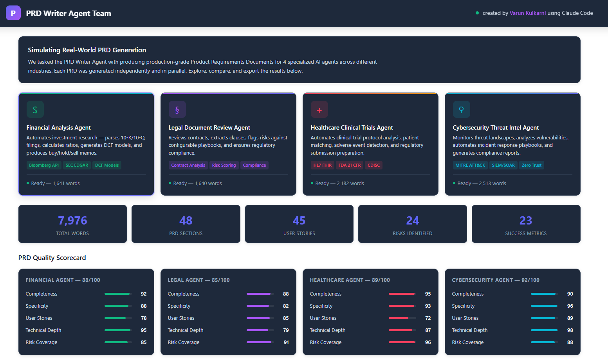
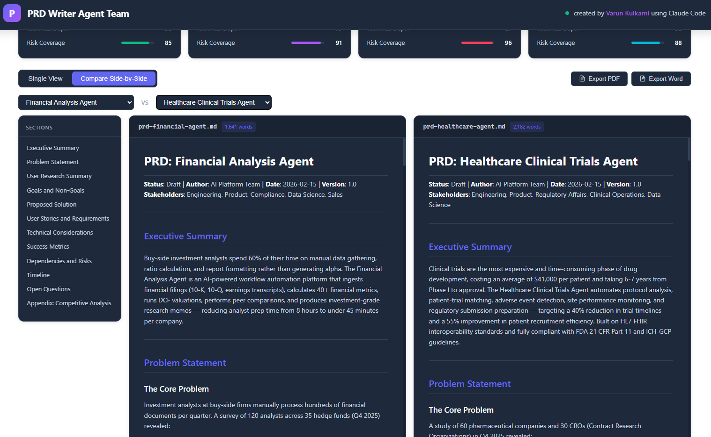
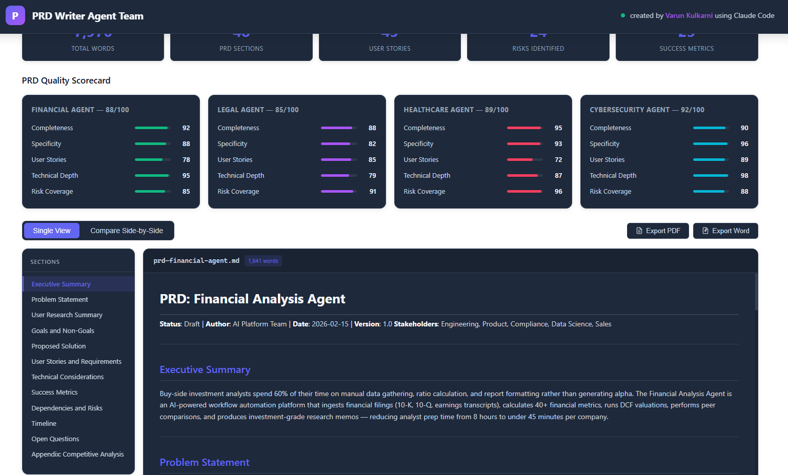

# ⚡ AI PM Agents - Specialized

**A multi-agent system that generates accurate, polished and executive ready production-grade Product Requirements Documents for AI Product Teams to move faster.**

[](https://claude.ai)
[]()

> **⚠️ Disclaimer:** All data in this project is entirely synthetic and mock-generated for demonstration purposes. Customer names, company names, financial figures, market data, and all agent outputs are fictional. No real customer data, proprietary information, or actual business metrics were used.

---

## 🎯 What This Does

Most AI tools generate generic documents. This multi agent AI system deploys **4 specialized AI agents in parallel**, each with domain-specific knowledge, to produce PRDs that pass muster with actual domain experts.

Each agent understands the regulatory landscape, technical constraints, and stakeholder dynamics of its industry - producing documents with real user stories, quantified success metrics, and identified risks that a PM could actually bring to a sprint planning meeting.

**Sample Screenshots:**


---


---

## 🏗️ Architecture

```
┌─────────────────────────────────────────────────┐
│              Orchestration Layer                 │
│         (Parallel Agent Coordination)            │
└──────────┬──────────┬──────────┬───────────┬────┘
           │          │          │           │
    ┌──────▼──┐ ┌─────▼───┐ ┌───▼─────┐ ┌──▼──────────┐
    │Financial│ │  Legal   │ │Healthcare│ │Cybersecurity│
    │ Agent   │ │  Agent   │ │  Agent   │ │   Agent     │
    │         │ │          │ │          │ │             │
    │Bloomberg│ │Contract  │ │HL7 FHIR │ │MITRE ATT&CK │
    │SEC EDGAR│ │Analysis  │ │FDA 21CFR│ │SIEM/SOAR    │
    │DCF Model│ │Risk Score│ │CDISC    │ │Zero Trust   │
    └────┬────┘ └────┬────┘ └────┬────┘ └──────┬──────┘
         │           │           │              │
    ┌────▼───────────▼───────────▼──────────────▼────┐
    │           Quality Scoring Engine                │
    │  Completeness · Specificity · User Stories      │
    │  Technical Depth · Risk Coverage                │
    └────────────────────┬───────────────────────────┘
                         │
              ┌──────────▼──────────┐
              │  Interactive Dashboard │
              │  Single View · Compare │
              │  Export PDF/Word       │
              └────────────────────────┘
```

→ See [docs/ARCHITECTURE.md](docs/ARCHITECTURE.md) for detailed system design.

---

## 📊 Results at a Glance

| Metric | Value |
|--------|-------|
| Total words generated | 7,976 |
| PRD sections produced | 48 |
| User stories written | 45 |
| Risks identified | 24 |
| Success metrics defined | 23 |

### Agent Quality Scores

| Agent | Overall | Completeness | Specificity | User Stories | Technical Depth | Risk Coverage |
|-------|---------|-------------|-------------|-------------|----------------|---------------|
| **Financial Analysis** | 88/100 | 92 | 88 | 78 | 95 | 85 |
| **Legal Document Review** | 85/100 | 88 | 82 | 85 | 79 | 91 |
| **Healthcare Clinical Trials** | 89/100 | 95 | 93 | 72 | 87 | 96 |
| **Cybersecurity Threat Intel** | 92/100 | 90 | 96 | 89 | 98 | 88 |

**Average quality score: 88.5/100** across all agents and dimensions.

→ See [docs/QUALITY_FRAMEWORK.md](docs/QUALITY_FRAMEWORK.md) for scoring methodology.

---

## 🔍 What Each Agent Produces

### Financial Analysis Agent
Automates investment research — parses 10-K/10-Q filings, calculates ratios, generates DCF models, and produces buy/hold/sell memos. Integrates with Bloomberg API, SEC EDGAR, and standard DCF frameworks.

### Legal Document Review Agent
Reviews contracts, extracts clauses, flags risks against configurable playbooks, and ensures regulatory compliance across GDPR, CCPA, SOX, and HIPAA frameworks.

### Healthcare Clinical Trials Agent
Automates clinical trial protocol analysis, patient matching, adverse event detection, and regulatory submission preparation using HL7 FHIR, FDA 21 CFR, and CDISC standards.

### Cybersecurity Intel Agent
Monitors threat landscapes, analyzes vulnerabilities, automates incident response playbooks, and generates compliance reports using MITRE ATT&CK, SIEM/SOAR, and Zero Trust frameworks.

→ See [docs/AGENT_DESIGN.md](docs/AGENT_DESIGN.md) for specialization approach.

---

## 💡 Why This Matters

This isn't just a demo of "AI writes documents." It demonstrates several product thinking principles:

1. **Multi-agent orchestration** — Coordinating specialized agents that run in parallel, each with domain-specific context windows and evaluation criteria
2. **Quality as a feature** — Every PRD is scored across 5 dimensions, making quality measurable and improvable rather than subjective
3. **Regulated industry awareness** — The agents reference actual standards (HL7 FHIR, MITRE ATT&CK, SOX compliance) that matter in enterprise deployments
4. **Comparative analysis** — Side-by-side comparison lets stakeholders evaluate agent outputs
5. **Export-ready outputs** — PDF and Word export means these PRDs can enter real product workflows

---

## 🛠️ Technical Stack

| Layer | Technology |
|-------|-----------|
| Frontend | React + Tailwind CSS (dark theme dashboard) |
| Agent Framework | Claude Code with parallel agent orchestration |
| Quality Engine | Custom 5-dimension scoring rubric |
| Export | PDF and Word document generation |
| Comparison | Side-by-side diff with synchronized navigation |

---

## 🚀 Getting Started

```bash
git clone https://github.com/varunk130/prd-writer-agent-team.git
cd prd-writer-agent-team
npm install
npm run dev
```

### Generate PRDs

```bash
npm run generate                        # All 4 agents in parallel
npm run generate -- --agent financial   # Single agent
```

---

## 📁 Repository Structure

```
prd-writer-agent-team/
├── README.md
├── LICENSE
├── docs/
│   ├── ARCHITECTURE.md
│   ├── QUALITY_FRAMEWORK.md
│   └── AGENT_DESIGN.md
├── agents/
│   ├── orchestrator.js
│   ├── financial-agent.js
│   ├── legal-agent.js
│   ├── healthcare-agent.js
│   └── cybersecurity-agent.js
├── scoring/
│   ├── quality-engine.js
│   └── rubrics/
├── output/
│   ├── prd-financial-agent.md
│   ├── prd-legal-agent.md
│   ├── prd-healthcare-agent.md
│   └── prd-cybersecurity-agent.md
└── screenshots/
```

---

## 📸 Screenshots

### Dashboard Overview


### Quality Scorecard


### Side-by-Side Comparison


---

## 🔮 Roadmap

- [ ] Human-in-the-loop editing
- [ ] Custom agent creation with configurable regulatory frameworks
- [ ] Version diffing across regeneration cycles
- [ ] Stakeholder feedback loops
- [ ] MCP integration for live data sources

---

<p align="center">
  <strong>Built by Varun Kulkarni</strong><br/>
  <sub>Powered by Claude Code</sub>
</p>
